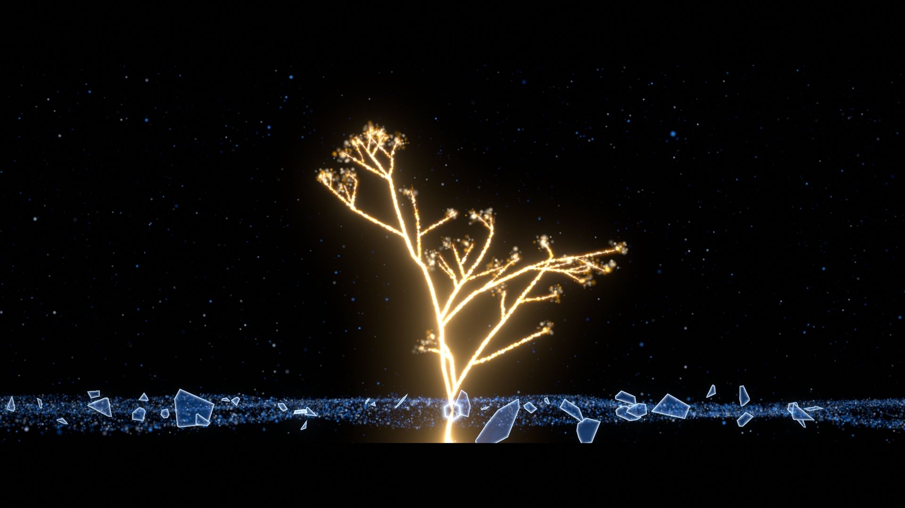
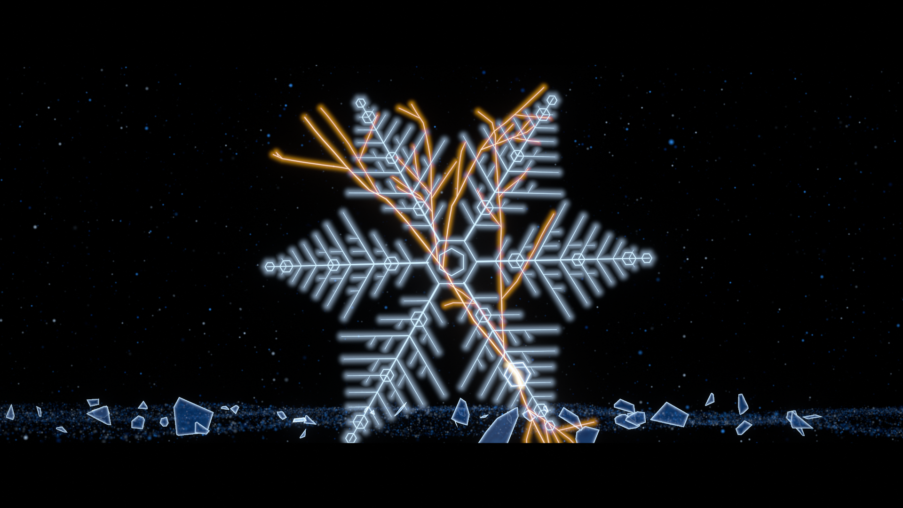
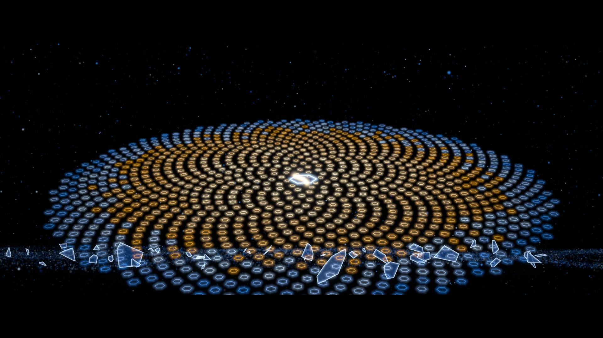

# 《熵》導演筆記 — 檢查點 1：提案

> 狀態：**等待確認**。請看完第 5 節（最終形狀）和第 9 節（需要你決定的事）再回覆。
> 結構總覽圖：[`docs/checkpoint1/arc.png`](docs/checkpoint1/arc.png)
> 三個候選的對照表：[`docs/checkpoint1/candidates.png`](docs/checkpoint1/candidates.png)

---

## 0. 先說明一件事

repo 裡**沒有 `STORYBOARD.md`**，`/music/` 也是空的。所以這份提案完全根據任務書裡的「核心」和「錨點」重新推出來。
如果你之後補上分鏡，我會逐條對照，保留有效的想法，並在第 3 節寫明哪裡不同、為什麼。

## 1. 我對作品的理解

這支片其實在講**兩種秩序**：

| | 第一幕的秩序 | 第三幕的秩序 |
|---|---|---|
| 誰造的 | 物理（結晶） | 生命（生長） |
| 形狀 | 六重對稱的雪花，完美、封閉 | 不對稱的分枝，開放、向上 |
| 畫框 | 1:1，封閉的方窗 | 2.39:1，一條地平線 |
| 色 | 冷白藍，無溫度 | 暖金，與冷藍共存 |

第二幕不是「秩序被摧毀」這麼簡單。**把第一種秩序打碎的那道裂痕，正是第二種秩序的形狀。**
所以整片只有一條關鍵的因果鏈，其他設計都為它服務：

```
雪花上的一枚六角小板（種子）
  └─ 第二幕：它第一個偏移 → 橙紅裂痕從它內部長出 → 裂痕蔓延、畫框碎裂
       └─ 第三幕：它第一個亮起（金） → 同一條裂痕的幾何，被「立起來」長成樹
            └─ 最終形狀：樹根處的那枚六角，裂縫以金色保留，並歪了 3.5°
```

裂痕和樹用的是**同一份資料**（`src/film/geometry.js` 的 `crack()`），不是看起來像，是真的同一條。
這就是「新的秩序帶著舊的裂痕」的字面實現：傷口不是被修好，而是長成了生命的骨架。

## 2. 視覺系統

- **第一幕：背光的霜玻璃。** 方窗內是淺灰藍的「玻璃」，雪花以更亮的白藍霜晶生長。我刻意讓第一幕**亮**：
  整片的明度弧線因此變成「亮 → 暗 → 暖光」，和情緒路徑「冷靜的美 → 失去的痛 → 安靜的希望」一致。
  也讓碎裂時的玻璃碎片在黑色中讀得清楚。
- **生長與音符對齊。** 雪花的生長前緣依主旋律逐音推進（每個八音盒音符推進一步）。
- **第二幕：那道橙紅色是全片唯一的色相外來者。** 它只存在於 slip → decay 之間，之後永不再出現。
- **碎裂就是字面上的畫框碎裂。** 1:1 方窗本身就是一片玻璃（整個第一幕的畫面是它的貼圖），
  在重擊那一格裂成 Voronoi 碎片，每一片帶著它原本那塊畫面飛出，露出後方 16:9 的黑暗。
  碎片以裂痕為中心加密分布，所以碎法和裂痕一致。
- **第三幕：一條河。** 冷藍的粒子河沿地平線橫向流動，那是熵的方向。舊玻璃碎片在河裡漂。
  金色的樹從河裡向上長，樹液在枝條內向上流：**「逆流」是一個看得見的方向**，不用解釋。
- **2.39:1 的「展開」。** 高潮前一小節（III-d「吸氣」），畫面收成一條地平線細縫（就是那條河）；
  在高潮強拍，細縫像眼睛一樣張開到 2.39:1。所以遮幅是「張開」，不是「裁切」。
  這也和第二幕「抽空 → 重擊」形成鏡像：一次是破壞前的吸氣，一次是誕生前的吸氣。

## 3. 相對於任務書，我主動做的決定（每條附理由）

1. **第一幕用淺色霜玻璃，而非黑底發光。** 理由見上：明度弧線強化情緒路徑，碎片也更清楚。
2. **抽空（靜默 1）給一整小節（3.33 秒），畫面時間重映射降到約 0.03×。** 太短的抽空會被聽成失誤；
   一整小節讓觀眾「感覺到東西要來了」。
3. **靜默 2 是 2.000 秒的延長記號（fermata），在節拍網格之外。** 讓時間真的停住，第三幕再重新起拍。
4. **音樂上的伏筆押韻。** 第二幕第一個走音的音（主旋律的第三級音），到尾聲的八音盒重奏時**仍然是走音的**，
   其他音都已調準。這是錨點 4 在聲音上的對應：新的旋律也帶著舊的裂痕。（寫在配樂規格裡）
5. **字幕排版提案（第 2 檢查點再定稿）：** 第一句直排在方窗右側的黑邊內（1:1 留下兩側各 528px 的空間，
   字在秩序之外，像旁白）；第二句橫排、灰、居中偏下；第三句直排、金。字幕都不壓在主體上。
6. **最終不做「整齊的收尾」。** 尾聲鏡頭推進到那枚六角和它的金色裂縫，在最後一個八音盒音的衰減中淡黑。
   最後一眼是那道不完美，而不是完整的樹。

## 4. 結構（臨時節拍：72 BPM，4/4）

選 72 BPM 是因為在 60fps 下**一拍正好 50 格**：每一拍、每一個八分音符都落在整數格上，所以卡點天生是 0 誤差。
完整時間見 `beatmap.json`，總覽見 `docs/checkpoint1/arc.png`。

| 幕 | 段落 | 小節 | 時間 | 發生什麼 |
|---|---|---|---|---|
| 一 秩序 | I-a 起點 | 1–4 | 0:00–0:13.3 | 黑。第一個八音盒音（2.1）出現一個光點；方窗漸亮 |
| | I-b 主題 | 5–12 | 0:13.3–0:40 | 雪花依旋律生長。字幕 1 |
| | I-c 結晶 | 13–20 | 0:40–1:06.7 | 玻璃琴加入；鏡頭推進到自相似的細部 |
| | I-d 完滿 | 21–24 | 1:06.7–1:20 | 完整的晶體。什麼都不動 |
| 二 崩解 | II-a 偏移 | 25–28 | 1:20–1:33.3 | **種子六角偏移**（第一個走音）；橙紅裂痕誕生（26.1） |
| | II-b 蔓延 | 29–32 | 1:33.3–1:46.7 | 預備鋼琴、大提琴撥弦；裂痕分岔 |
| | II-c 抽空 | 33 | 1:46.7–1:50 | **靜默 1**；時間幾乎停止 |
| | II-d 重擊 | 34–35 | 1:50–1:56.7 | **太鼓**。畫框碎裂成全幅；慢鏡頭 |
| | II-e 崩落 | 36–41 | 1:56.7–2:16.7 | 碎片化為塵；橙紅熄滅；去飽和 |
| | II-f 散去 | 42–44 | 2:16.7–2:26.7 | 近黑白的塵。字幕 2 |
| | II-g 靜默 | — | 2:26.7–2:28.7 | **靜默 2**，完全無聲 2.0 秒 |
| 三 重組 | III-a 餘燼 | 45–48 | 2:28.7–2:42 | 二胡。**種子六角第一個亮起** |
| | III-b 逆流 | 49–56 | 2:42–3:08.7 | 字幕 3（47.1 起）；塵逆流湧向種子；第一根金枝（53.1） |
| | III-c 生長 | 57–62 | 3:08.7–3:28.7 | 弦樂、合唱哼鳴；樹長出；冷藍回來 |
| | III-d 吸氣 | 63 | 3:28.7–3:32 | 畫面收成地平線細縫 |
| | III-e 高潮 | 64–69 | 3:32–3:52 | **展開為 2.39:1**；冷藍與暖金共存；飽和度全片最高 |
| | III-f 尾聲 | 70–71 | 3:52–4:00 | 推到六角的金縫；最後一個八音盒音；淡黑 |

總長 **4:00.000**（14400 格）。三幕長度是 80 s / 68.7 s / 91.3 s。

## 5. 最終形狀：三個候選

每個候選都擺在高潮的實際畫面裡（2.39:1 遮幅、冷藍的河、漂浮的舊碎片），右側是保留的不完美的特寫。
圖片都是用正式渲染引擎產生的，不是示意圖。

### A　裂痕之樹 —— **推薦**

**把整片玻璃打碎的那道裂痕，被立起來，長成一棵金色的樹；裂痕起點的六角成了它的根。**
特寫：[`final_A_seed.png`](docs/checkpoint1/final_A_seed.png)：金色的縫穿過冷色的六角，出了六角就變粗成樹幹。
- 往上長的是樹冠，裂痕往另一頭的分支成了地平線下的根。
- 推薦理由：只有它讓「新的秩序帶著舊的裂痕」**同時**成立在形狀、因果和動作（往上、逆流）三個層次上。

### B　金繼之晶

**雪花重新拼回來，每一條裂縫都以金填滿（金繼），種子六角偏離原位。**
- 優點：和第一幕的鏡像最直接，觀眾一眼就懂。
- 問題：它說的是「修復」，而不是「生命創造新的秩序」；還是封閉的六重對稱，和 2.39:1 的橫向開放感互相抵觸。
  畫面上金線和雪花互相打架，我不認為能調到 A 的純度。

### C　向光螺旋

**碎片以黃金角重新長成葉序螺旋，種子在最中心，是生長的起點；中心暖金、外圈冷藍。**
- 優點：生命的數學，冷暖共存的層次最清楚。
- 問題：裂痕只剩那一枚六角，和第二幕的連結最弱；畫面偏「圖樣」，容易被讀成裝飾。

## 6. 錨點對照

| 錨點 | 實現方式 | 狀態 |
|---|---|---|
| 1 三幕、4:00 ±15 s | 80 / 68.7 / 91.3 s，總長 240.000 s | ✅ 結構已鎖定於 beatmap |
| 2 畫幅敘事 | 1:1 方窗（864px 見方）→ 34.1 碎裂成 16:9 → 64.1 由細縫張開為 2.39:1（803px 高） | ✅ 設計完成；渲染在檢查點 2/3 |
| 3 色彩弧線 | token 表 + 每段飽和度曲線（arc.png 第 4 列）：0.55 → 1.35 → 0 → 1.6 | ✅ 表已建立 |
| 4 伏筆碎片 | 種子六角：第一個偏移（25.1）＝第一個亮起（45.1）＝樹根的金縫。聲音上也有對應 | ✅ |
| 5 兩次靜默 | 抽空：33.1–34.1（3.33 s，≤ −40 dBFS）；靜默 2：146.667–148.667 s（2.000 s 數位靜音） | ✅ click track 中已是真靜音 |
| 6 三句字幕 | 原文不改；時間在 beatmap.json `subtitles`，每句 8.3–10 s | ✅ |
| 7 最終形狀 | 三個候選，推薦 A | ⏳ 等你確認 |

## 7. 技術方案

- **渲染器：** 自寫 WebGL2（`src/engine/`），由無頭 Chromium（SwiftShader）執行，逐格讀回後直接送進 ffmpeg。
  場景是 `frame → 畫面` 的**純函數**：所有運動都寫在著色器裡，只依賴時間和每個元素的靜態參數，
  所以任何一格都能單獨、依任意順序、平行渲染，也能在瀏覽器裡即時拖時間軸預覽。
- **60fps 與慢鏡頭：** 原生逐格渲染 60fps。慢鏡頭是**程序化時間重映射**：畫面使用故事時間 τ(t)＝∫speed(t)dt，
  不做抽幀、不做插值。
- **抗鋸齒 / 防閃爍：** 2×2 超採樣 ＋ 4× MSAA；線條用解析式覆蓋率（距離場）；粒子有最小像素尺寸，
  過小時等能量縮小亮度而不是縮小尺寸（避免次像素粒子閃爍）；輸出前加三角分布抖色，防止暗部色帶。
  元素的出現和消失一律用生長或淡入淡出，沒有硬切。
- **色彩：** 只有 `src/film/tokens.js` 的 24 個 token。著色器只接受 token 索引；漸層也只是兩個 token 之間的插值。
  後製（輝光、色調曲線、飽和度曲線、顆粒）是寫在同一個檔裡的固定轉換。
- **卡點：** 引擎只讀 `beatmap.json`。換了音樂，重新產生 beatmap，畫面就自動重新對齊。
- **HDR 管線：** 半精度浮點緩衝 → 7 級輝光 → 膝點以下線性（token 顏色保真）、膝點以上柔和壓縮的色調曲線。
- **效能（實測）：** 目前的高潮畫面，1080p／2× 超採樣約 2.9 s/格（含 PNG 編碼）。
  依現狀推算，最終渲染約 8–10 小時，720p30 預覽約 1–2 小時。檢查點 3 前我會先做粒子 LOD 和半解析度輝光，
  目標是把最終渲染壓到 6 小時內。這只影響交付時間，不影響畫質。

## 8. 音樂

還沒有音軌，所以依錨點建立了臨時結構：
- `beatmap.json`：284 拍、22 個卡點、2 段靜默、3 句字幕，全部以格數為準。
- `music/temp_click.mp3`：click track（重拍高音、卡點提示音、重擊處低頻），兩段靜默是真的 0。
- **配樂需求規格：[`docs/MUSIC_SPEC.md`](docs/MUSIC_SPEC.md)**，可以直接交給作曲者或生成工具。

拿到音軌後放進 `/music/`，我會先分析節拍、強拍、段落和靜音區，重新產生 `beatmap.json`，再把分鏡對齊到**音樂的實際結構**。
音樂才是主時鐘，72 BPM 只是暫時的。

## 9. 需要你決定的事

1. **最終形狀**：A / B / C（或混合，例如 A 的樹，但高潮時樹冠邊緣帶一點 C 的葉序排列）。
2. **第一幕用淺色霜玻璃**（我的提案），還是傳統的黑底發光？
3. **抽空的長度**：一整小節 3.33 s 可以嗎？還是縮成兩拍（1.67 s）？
4. 有沒有 `STORYBOARD.md` 要補上？

確認後進入**檢查點 2：風格幀**（每幕 2 張關鍵靜幀）。

## 10. 自審（交付前的檢查）

我抽查了所有靜幀，對照錨點和精度標準，以下是修正紀錄和還沒解決的偏差：

- 修正：輝光原本用世界座標，特寫時變成粗管 → 改為在螢幕空間限制輝光半徑。
- 修正：樹液粒子全部經過樹幹，疊加後把種子六角完全蓋住 → 依下游葉數正規化密度。
- 修正：金色原本太「檸檬黃」 → 調整 gold token，高潮飽和度從 1.6 降為 1.15（在靜幀裡；時間軸上的值會在風格幀階段校準）。
- 修正：B 的雪花超出遮幅 → 縮小到 1.12。
- **未解決**：A 的特寫中，細金縫在色調曲線下偏粉白，還不夠「金」 → 檢查點 2 改用 gold-1 的外暈，讓細線保持色相。
- **未解決**：C 的冷暖交界仍有些同心環狀的色帶 → 若選 C 再處理。
- **偏差**：`tokens.js` 裡的 GRADE 飽和度曲線（arc.png）和靜幀用的值不一致（1.6 vs 1.15），風格幀階段統一。
- 靜幀的時間參數固定，未測動態閃爍；動態檢查在檢查點 3 的預覽做。

## 附：檔案與指令

```
node tools/beatmap.mjs          # 重新產生 beatmap.json 與 click track（wav）
node tools/still.mjs A B C      # 重新渲染三個候選靜幀 → docs/checkpoint1/
python3 tools/boards.py         # 重新產生 candidates.png / arc.png
```
需要：Node 22 + Playwright（附 Chromium），ffmpeg，Python 3 + Pillow。一鍵渲染整片的指令會在檢查點 3 加上。

---

## 11. 檢查點 1 修正：克制（v2）

並排比較：[`docs/checkpoint1/compare_v1_v2.png`](docs/checkpoint1/compare_v1_v2.png)（左 v1，右 v2）。
刪除測試原圖：`docs/checkpoint1/deletion/`（`node tools/deletion_test.mjs` 重現）。

### 新規則寫進系統
- **發光預算：** 輝光只在兩個時刻開啟：34.1 重擊，以及 64.1 最終成形的那一下（短暫，隨後退回照明）。
  其餘時間 bloom＝0、線條外暈＝0。靜幀是成形後的穩態，所以不發光。
- **金色：** gold token 改成舊金／黃銅（`#e6d3ab / #b08a52 / #7d6038 / #35281a`），不再有白熱核心。
  azure 也同步降飽和（`#b4c8da / #4f6f8f / #1c2c3e`），讓冷暖共存靠色相，不靠亮度。
- **光的邏輯：** 物體是被照亮的，不是自己發光。沒有暗角、沒有擴散光霧，暗部就是純黑。
- **飽和度曲線重新定義：** 「全片最高」是相對於這片自己，不是絕對的鮮豔。高潮的後製飽和度改為 1.0，靠 token 本身。

### 刪除測試：刪掉什麼、保留什麼

| 效果 | 測試結果 | 決定 | 理由 |
|---|---|---|---|
| 星空塵埃（16k 粒子） | 拿掉後鏡頭完全成立 | **刪除** | 純氛圍，也是星空長曝光的語彙 |
| 河上漂浮碎片 | 拿掉後兩側空了，但成立 | **刪除** | 只是為了填 2.39:1 的空 |
| 樹梢花簇粒子 | 拿掉後成立 | **刪除** | 裝飾 |
| 線條外暈＋bloom | A/B/C 拿掉後都成立（`*_no-halo.png`） | **刪除**（只留給兩個發光時刻） | 靜態時是炫技 |
| 暗角 | 純黑背景下無作用 | **刪除** | — |
| 冷藍的河 | 拿掉後地平線和「流向」都消失（`A_no-river.png`） | **保留**，粒子 42k → 10k、亮度減半 | 它就是熵的方向，「逆流」要有流可逆 |
| 樹液（向上的流） | 靜幀中拿掉反而更乾淨（`A_no-sap.png`） | **暫時保留**，16k → 4k | 只有在動態中才能表達向上的流；檢查點 3 的動態預覽再測一次，不成立就刪 |
| 種子六角的玻璃面 | 拿掉後六角變成空框，讀不出「一塊碎片」 | **保留**，亮度降到 0.35 | 它是伏筆物件本身 |

粒子總數：約 78k → **14k**（約 1/5.5）。

### 量測（2.39:1 可視區內）

| | 高光面積（>80%） | 純黑面積（<2%） |
|---|---|---|
| A v1 → v2 | 1.75% → **0.05%** | 72% → **97%** |
| B v1 → v2 | 1.83% → **0.00%** | 69% → **96%** |
| C v1 → v2 | 0.78% → **0.00%** | 56% → **96%** |

### 修正後的觀察
- 克制之後差距更明顯：**A 仍然成立**，一棵黃銅色的細樹、一條冷的地平線，其餘都是黑。
  B 變成兩層線稿互相重疊，更像圖解；C 的點陣少了光之後近乎消失。推薦依舊是 A。
- v1 未解決的「特寫金縫偏粉白」：已經消失（原因是外暈，不是 token）。
- 新的風險：v2 可能太暗、太細，在小螢幕上會讀不出來。檢查點 2 的風格幀我會在手機尺寸下檢查可讀性。
